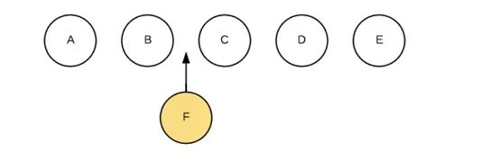
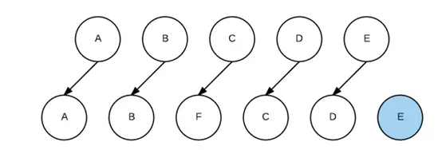
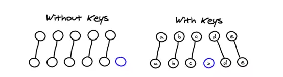

# Q3：你知道vue中key的作用和工作原理吗？说说你对它的理解

vue实现了一套虚拟DOM，使我们可以不直接操作DOM元素，只操作数据便可以重新渲染页面。而隐藏在背后的原理是Diff算法。Diff算法的核心是基于两个简单的假设：

1. 两个相同的组件产生类似的DOM结构，不同的组件产生不同的DOM结构。

2. 同一层级的一组节点，它们可以通过唯一的id进行区分。

当某一层有很多相同的节点时，也就是列表节点时，Diff算法的更新过程默认情况下也是遵循以上原则。

比如我们希望在B和C之间加一个F：

Diff算法默认执行起来是这样的：

要使用key来给每个节点做一个唯一标识，Diff算法就可以正确的识别此节点，找到正确的位置区插入新的节点。

key的作用主要是为了高效的更新虚拟DOM。另外vue中在使用相同标签名元素的过渡切换时，也会使用到key属性，其目的也是为了让vue可以区分它们，否则vue只会替换其内部属性而不会触发过渡效果。
