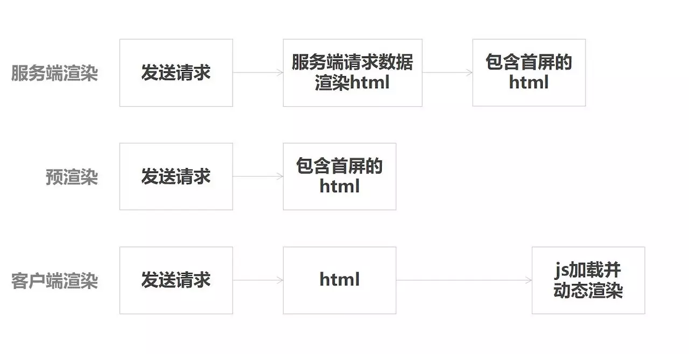

# Q10：你了解哪些vue性能优化的方法？

## 如何定位Vue应用性能问题

Vue应用的性能问题可以分为两个部分，第一部分是运行时性能问题，第二部分是加载性能问题。

和其他 web 应用一样，定位 Vue 应用性能问题最好的工具是 Chrome Devtool，通过 Performance 工具可以用来录制一段时间的 CPU 占用、内存占用、FPS 等运行时性能问题，通过 Network 工具可以用来分析加载性能问题。

例如，通过 Performance 工具的 Bottom Up 标签我们可以看出一段时间内耗时最多的操作，这对于优化 CPU 占用和 FPS 过低非常有用，可以看出最为耗时的操作发生在哪里，可以知道具体函数的执行时间，定位到瓶颈之后，我们就可以做一些针对性的优化。

## Vue应用运行时性能优化建议

运行时性能主要关注 Vue 应用初始化之后对 CPU、内存、本地存储等资源的占用，以及对用户交互的及时响应。

### 引入生产环境的Vue文件

开发环境下，Vue 会提供很多警告来帮你对付常见的错误与陷阱。而在生产环境下，这些警告语句没有用，反而会增加应用的体积。有些警告检查还有一些小的运行时开销。

当使用 webpack 或 Browserify 类似的构建工具时，Vue 源码会根据 process.env.NODE_ENV 决定是否启用生产环境模式，默认情况为开发环境模式。在 webpack 与 Browserify 中都有方法来覆盖此变量，以启用 Vue 的生产环境模式，同时在构建过程中警告语句也会被压缩工具去除。

### 使用单文件组件预编译模板

当使用 DOM 内模板或 JavaScript 内的字符串模板时，模板会在运行时被编译为渲染函数。通常情况下这个过程已经足够快了，但对性能敏感的应用还是最好避免这种用法。

预编译模板最简单的方式就是使用单文件组件——相关的构建设置会自动把预编译处理好，所以构建好的代码已经包含了编译出来的渲染函数而不是原始的模板字符串。

### 提取组件的CSS到单独的文件

当使用单文件组件时，组件内的 CSS 会以`<style>`标签的方式通过 JavaScript 动态注入。这有一些小小的运行时开销，将所有组件的 CSS 提取到同一个文件可以避免这个问题，也会让 CSS 更好地进行压缩和缓存。

### 利用`Object.freeze()`提升性能

`Object.freeze()`可以冻结一个对象，冻结之后不能向这个对象添加新的属性，不能修改其已有属性的值，不能删除已有属性，以及不能修改该对象已有属性的可枚举性、可配置性、可写性。该方法返回被冻结的对象。

当你把一个普通的 JavaScript 对象传给 Vue 实例的`data`选项，Vue 将遍历此对象所有的属性，并使用`Object.defineProperty`把这些属性全部转为`getter/setter`，这些`getter/setter`对用户来说是不可见的，但是在内部它们让 Vue 追踪依赖，在属性被访问和修改时通知变化。

但 Vue 在遇到像`Object.freeze()`这样被设置为不可配置之后的对象属性时，不会为对象加上`getter/setter`等数据劫持的方法。使用了 Object.freeze() 之后，减少了 observer 的开销。

由于`Object.freeze()`会把对象冻结，所以比较适合展示类的场景，如果你的数据属性需要改变，可以重新替换成一个新的 Object.freeze()的对象。

> ps：如果不希望数据被 observer，可以在created的生命周期中把数据挂载到 this 上，并不一定都在 data、props 或者是 computed 中定义。这部分数据也是可以被修改的，只是他们的变化不会触发组件重新渲染，这样比用`Object.freeze()`更加灵活。

### 扁平化 Store 数据结构

对于深层嵌套的树形结构，如果想修改某个信息，我们可能需要一层层去遍历找到这个信息，同时有可能这个信息出现了多次，还需要把其他地方的信息也进行修改，每次遍历的过程会带来额外的性能开销。

#### JSON数据规范化（normalize）

可以自行转化也可以使用开源工具`Normalizr`，可以将上面的深层嵌套的 JSON 对象通过定义好的 schema 转变成使用 id 作为字典的实体表示的对象。时间复杂度降低到了 O(1)。

### 避免持久化 Store 数据带来的性能问题

#### 避免频繁写入持久化数据

如向 localstorage 写入数据。我们应该尽量减少直接写入 Storage 的频率：

1、多次写入操作合并为一次，比如采用函数节流或者将数据先缓存在内存中，最后在一并写入
2、只有在必要的时候才写入，比如只有关心的模块的数据发生变化的时候才写入

#### 避免持久化存储的容量持续增长

如 localstorage 的缓存在某些浏览器只有 5M，我们不能无限制的将所有数据都存起来，这样很容易达到容量限制，同时数据过大时，读取和写入操作会增加一些性能开销，同时内存也会上涨。

当设计了一套持久化的数据缓存策略的时候，同时应该设计旧数据的缓存清除策略，例如请求到新数据的时候将旧的实体逐个进行清除。

### 优化无限列表性能

如果你的应用存在非常长或者无限滚动的列表，那么采用 窗口化 的技术来优化性能，只需要渲染少部分区域的内容，减少重新渲染组件和创建 dom 节点的时间。

vue-virtual-scroll-list 和 vue-virtual-scroller 都是解决这类问题的开源项目。你也可以参考 Google 工程师的文章Complexities of an Infinite Scroller 来尝试自己实现一个虚拟的滚动列表来优化性能，主要使用到的技术是 DOM 回收、墓碑元素和滚动锚定。

### 通过组件懒加载优化超长应用内容初始渲染性能

在一个复杂的应用的主界面中，整个主界面由非常多不同的模块组成，而用户看到的往往只有首屏一两个模块。在初始渲染的时候不可见区域的模块也会执行和渲染，带来一些额外的性能开销。使用组件懒加载在不可见时只需要渲染一个骨架屏，不需要真正渲染组件。你可以对组件直接进行懒加载，对于不可见区域的组件内容，直接不进行加载和初始化，避免初始化渲染运行时的开销。

## Vue应用加载性能优化建议

### 利用服务端渲染（SSR）和预渲染（Prerender）来优化加载性能

在一个单页应用中，往往只有一个 html 文件，然后根据访问的 url 来匹配对应的路由脚本，动态地渲染页面内容。单页应用比较大的问题是首屏可见时间过长。

单页面应用显示一个页面会发送多次请求，第一次拿到 html 资源，然后通过请求再去拿数据，再将数据渲染到页面上。而且由于现在微服务架构的存在，还有可能发出多次数据请求才能将网页渲染出来，每次数据请求都会产生 RTT（往返时延），会导致加载页面的时间拖的很长。

这种情况下可以采用服务端渲染（SSR）和预渲染（Prerender）来提升加载性能，这两种方案，用户读取到的直接就是网页内容，由于少了节省了很多 RTT（往返时延），同时，还可以对一些资源内联在页面，可以进一步提升加载的性能。

### 通过组件懒加载优化超长应用内容加载性能

使用组件懒加载方案对于超长内容的应用初始化渲染很有帮助，可以减少大量必要的资源请求，缩短渲染关键路径。

> 参考：https://www.jianshu.com/p/4e15f4cd7321